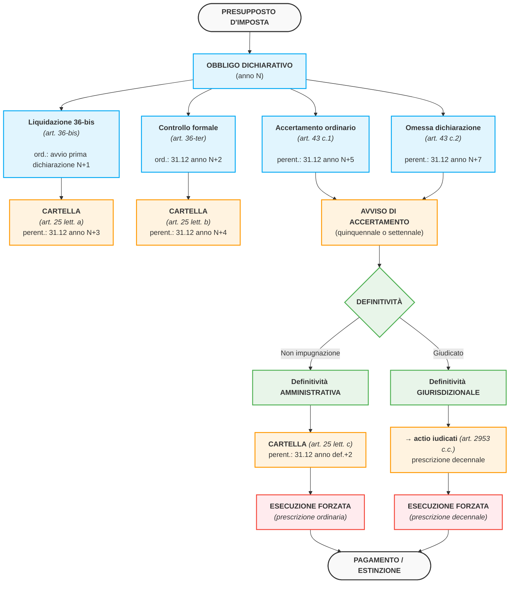

# Schema dei termini di decadenza nell'ordinamento tributario italiano

## Dalla liquidazione automatizzata all'accertamento: la matrice dei termini e dei modificatori (riduttivi/incrementativi)

*Dispensa sistematica — allegato al materiale didattico sulla prescrizione e decadenza nel diritto tributario.*

---

**Nota metodologica.** Lo schema si articola in tre livelli progressivi: (I) **tabella sinottica principale** delle attività impositive e dei rispettivi termini decadenziali codicistici; (II) **schema grafico della "staffetta" dei termini** lungo la sequenza presupposto → accertamento → titolo → riscossione; (III) **matrice dei coefficienti modificatori** — riduttivi (pagamenti tracciabili, ISA) e incrementativi (attività estere, omessa dichiarazione, CPB e ravvedimento speciale). La trattazione riflette il quadro normativo aggiornato al d.lgs. 108/2024 e al d.lgs. 33/2025 (nuovo Testo Unico in materia di accertamento e riscossione).

---

## I. Tabella sinottica principale

| Attività | Norma base | Termine ordinario (*a pena di decadenza*) | *Dies a quo* | Natura del termine per l'**attività** interna | Conseguenza del superamento |
|---|---|---|---|---|---|
| **Liquidazione automatizzata** (art. 36-bis) | Art. 36-bis d.P.R. 600/1973 (IIDD); art. 54-bis d.P.R. 633/1972 (IVA) | Inizio del periodo di presentazione delle dichiarazioni dell'anno successivo | Presentazione della dichiarazione | **Ordinatorio** (Cass. SS.UU. n. 21498/2004) | — |
| **Cartella post-36-bis** | Art. 25, c. 1, lett. *a*, d.P.R. 602/1973 | **31.12 del 3° anno** successivo alla presentazione della dichiarazione | Presentazione dichiarazione | **Perentorio** | Decadenza della pretesa |
| **Controllo formale** (art. 36-ter) | Art. 36-ter d.P.R. 600/1973 | **31.12 del 2° anno** successivo alla presentazione della dichiarazione | Presentazione dichiarazione | **Ordinatorio** (Cass. SS.UU. n. 21498/2004) | — |
| **Cartella post-36-ter** | Art. 25, c. 1, lett. *b*, d.P.R. 602/1973 | **31.12 del 4° anno** successivo alla presentazione della dichiarazione | Presentazione dichiarazione | **Perentorio** | Decadenza della pretesa |
| **Accertamento ordinario** (IIDD + IVA) | Art. 43, c. 1, d.P.R. 600/1973; art. 57, c. 1, d.P.R. 633/1972 | **31.12 del 5° anno** successivo alla presentazione della dichiarazione | Presentazione dichiarazione | **Perentorio** | Decadenza del potere impositivo |
| **Accertamento in caso di omessa dichiarazione** | Art. 43, c. 2, d.P.R. 600/1973; art. 57, c. 2, d.P.R. 633/1972 | **31.12 del 7° anno** successivo a quello *in cui la dichiarazione avrebbe dovuto essere presentata* | Anno di omessa presentazione | **Perentorio** | Decadenza del potere impositivo |
| **Cartella post-accertamento definitivo** | Art. 25, c. 1, lett. *c*, d.P.R. 602/1973 (oggi trasposto nel nuovo TU, d.lgs. 33/2025) | **31.12 del 2° anno** successivo alla definitività dell'atto | Definitività dell'atto (amministrativa o giurisdizionale) | **Perentorio** (per definitività amministrativa); convertito in **prescrizione decennale** *ex* art. 2953 c.c. se giudicato (Cass. SS.UU. 23397/2016; Cass. 25222/2024) | Decadenza (o maturazione prescrizione) |
| **Cartella in caso di decadenza dalla rateazione dell'avviso bonario** | Art. 25, c. 1, lett. *c-bis*, d.P.R. 602/1973 (introdotto dal d.lgs. 159/2015) | **31.12 del 3° anno** successivo alla scadenza dell'ultima rata | Scadenza ultima rata | **Perentorio** | Decadenza |
| **Atti di irrogazione delle sanzioni** | Art. 20 d.lgs. 472/1997 (come modificato dal d.lgs. 173/2024) | **31.12 del 5° anno** successivo alla commissione della violazione (o termine di accertamento del tributo connesso, se più ampio) | Commissione violazione / presentazione dichiarazione | **Perentorio** | Decadenza |

**Principio cardine** — *Corte Cost. n. 280/2005*: il termine per la notifica dell'atto *esterno* (cartella, avviso) deve essere **fissato a pena di decadenza** e **proporzionato alla complessità dell'attività**: da cui l'articolazione crescente 3 / 4 / 5 anni per liquidazione / controllo formale / accertamento.

---

## II. Schema grafico: la "staffetta" dei termini

**Snodi di raccordo** (dettaglio operativo):

(i) **da *ordinatorio* a *perentorio***: i termini degli artt. 36-bis e 36-ter sono *ordinatori* (regolano il rapporto interno tra Amministrazione e contribuente); divengono *perentori* solo nel segmento "esterno" di notifica della cartella *ex* art. 25 d.P.R. 602/1973;

(ii) **da *decadenza* a *prescrizione***: una volta emesso l'atto esecutivo, il regime *decadenziale* (che presidia il *potere* di accertare o di formare il titolo) lascia spazio al regime *prescrizionale* (che presidia il *credito* ormai cristallizzato nel titolo);

(iii) ***actio iudicati***: la definitività *per giudicato* comporta — per l'orientamento consolidato delle SS.UU. (n. 23397/2016) — la *conversione* del termine prescrizionale breve in decennale *uniforme* *ex* art. 2953 c.c., con esclusione della sola ipotesi della cartella non opposta (che non costituisce titolo giudiziale).

---

## III. Matrice dei coefficienti modificatori

### III.A. Modificatori **riduttivi** dei termini di accertamento ordinario (art. 43 d.P.R. 600/1973 e art. 57 d.P.R. 633/1972)

#### (1) Riduzione per pagamenti tracciabili — art. 3, c. 1, d.lgs. 127/2015

| Profilo | Disciplina |
|---|---|
| **Coefficiente riduttivo** | **– 2 anni** |
| **Termine risultante** | Da 5 a **3 anni** (accertamento ordinario); da 7 a **5 anni** (omessa dichiarazione) |
| **Ambito oggettivo** | Solo redditi di **impresa** e di **lavoro autonomo** + **IVA** |
| **Requisiti sostanziali (cumulativi)** | (i) documentazione integrale delle operazioni attive mediante **fatturazione elettronica via SdI** e/o **memorizzazione elettronica e invio telematico dei corrispettivi**; (ii) **tracciabilità di tutti** gli incassi e pagamenti di importo **> 500 €** (mezzi individuati dall'art. 3 D.M. 4.8.2016); (iii) **barratura della casella** di comunicazione nel quadro RS del Modello Redditi (rigo RS 136 per PF/SP; rigo RS 269 per SC) |
| **Requisito formale** | La **mancata comunicazione in dichiarazione** rende **inefficace** la riduzione (D.M. 4.8.2016, art. 4; Agenzia delle Entrate, risposta a interpello n. 77/2026) |
| **Limite applicativo** | **Anche una sola** operazione regolata con strumenti non tracciabili superiore a 500 € esclude il beneficio per l'intero periodo d'imposta |
| **Non cumulabilità** | Non cumulabile con la riduzione biennale *ex* regime di *cooperative compliance* (art. 6, c. 1, d.lgs. 128/2015, come novellato dal d.lgs. 221/2023): prevale quella per adempimento collaborativo |

#### (2) Riduzione per ISA — art. 9-bis, c. 11, lett. *e*, d.l. 50/2017

| Profilo | Disciplina |
|---|---|
| **Coefficiente riduttivo** | **– 1 anno** |
| **Termine risultante** | Da 5 a **4 anni** (accertamento ordinario); da 7 a **6 anni** (omessa dichiarazione) |
| **Ambito oggettivo** | Solo redditi di **impresa** e di **lavoro autonomo** (perimetro ISA) |
| **Requisito** | Punteggio ISA **≥ 8** nel periodo d'imposta di riferimento |
| **Rilievo della media biennale** | **Esclusa** per la riduzione dei termini: la misura si applica **solo** sul punteggio dell'anno in esame e non sulla media semplice del biennio precedente (Provv. Agenzia delle Entrate 11.4.2025, n. 176203) — a differenza di altri benefici premiali (esonero da visto di conformità, esclusione da società non operative) |
| **Decadenza del beneficio** | Se in sede di verifica il punteggio ISA viene rettificato al di sotto della soglia di 8, il beneficio decade e si riaprono i termini ordinari (Cass. n. 28457/2024, in applicazione analogica ai c.d. *studi di settore*) |

#### (3) Cooperative compliance — art. 6, c. 1, d.lgs. 128/2015 (modificato dal d.lgs. 221/2023)

| Profilo | Disciplina |
|---|---|
| **Coefficiente riduttivo** | **– 2 anni** (a regime, dal p.i. 2024) |
| **Termine risultante** | Da 5 a **3 anni** |
| **Ambito soggettivo** | Soggetti ammessi al regime di adempimento collaborativo |
| **Rilievo** | Prevale sulla riduzione per pagamenti tracciabili (ove coesistano i presupposti) |

---

### III.B. Modificatori **incrementativi** dei termini

#### (4) Raddoppio per attività estere in Paesi *black list* — art. 12, cc. 2-*bis* e 2-*ter*, d.l. 78/2009 (conv. l. 102/2009)

| Profilo | Disciplina |
|---|---|
| **Coefficiente incrementativo** | **× 2** (raddoppio) |
| **Termine risultante** | Da 5 a **10 anni** (accertamento ordinario); da 7 a **14 anni** (omessa dichiarazione) |
| **Ambito oggettivo** | (i) Accertamento dei maggiori redditi presuntivamente derivati dagli investimenti/attività finanziarie detenuti in Paesi *black list* (art. 12, c. 2-*bis*); (ii) irrogazione delle sanzioni per violazione degli obblighi di monitoraggio fiscale — quadro RW (art. 12, c. 2-*ter*) |
| **Nozione di *black list*** | Paesi individuati dai D.M. 4.5.1999 e 21.11.2001, come successivamente modificati (rilievo del dato temporale: va considerata la qualificazione dello Stato nell'anno di commissione della violazione — Cass. n. 34879/2025) |
| **Natura e retroattività** | *Presunzione di evasione* (art. 12, c. 2) → **natura sostanziale** → **non retroattiva** (Cass. SS.UU. orientamento consolidato: nn. 29632/2019, 30742/2018, 17928/2021, 16314/2024, confermato da FiscoOggi febbr. 2025). *Raddoppio dei termini* (cc. 2-*bis* e 2-*ter*) → **natura procedimentale** → **retroattivo** *tempus regit actum* (Cass. n. 8653/2022; Cass. n. 34879/2025). **Nota critica**: la bipartizione — natura sostanziale della presunzione *ma* procedimentale del raddoppio funzionalmente ad essa collegato — è oggetto di rilievi dottrinali (cfr. *supra*, § 9.1 del report comparatistico) |
| **Profili CGUE** | Possibile frizione con i principi di **proporzionalità** e **libera circolazione dei capitali** (art. 63 TFUE) alla luce di *Modelo 720* (C-788/19, 27.1.2022) — specie in presenza di cooperazione amministrativa effettiva (DAC, CRS) |

#### (5) Proroga per adesione al Concordato Preventivo Biennale 2024-2025

| Profilo | Disciplina |
|---|---|
| **Norma** | Art. 34, c. 2, d.lgs. 13/2024 |
| **Effetto** | Slittamento **al 31.12.2026** dei termini di accertamento in scadenza al 31.12.2025 per i soggetti aderenti al CPB 2024-2025 |
| **Presupposto** | Adesione al CPB (proroga **automatica**, non richiede alcun adempimento ulteriore) |

#### (6) Proroga per ravvedimento speciale 2024 (annualità 2018-2022)

| Profilo | Disciplina |
|---|---|
| **Norma** | Art. 2-*quater*, c. 14, d.l. 113/2024 (conv. l. 143/2024) |
| **Effetto** | Proroga **al 31.12.2027** dei termini di accertamento per le annualità 2018, 2019, 2020, 2021 per i soggetti ISA che aderiscono al CPB 2024-2025 e si avvalgono del regime di ravvedimento |
| **Presupposto** | Soggetto ISA + adesione CPB + ravvedimento speciale |

---

## V. Tabella-riepilogo finale: matrice complessiva

| **Attività** | **Base** | **ISA (≥8)** | **Pagamenti tracciabili** | **Cooperative compliance** | ***Black list*** | **CPB 2024-25** | **Ravvedimento speciale 2018-21** |
|---|---|---|---|---|---|---|---|
| Cartella post-36-bis | 3 anni | — | — | — | — | +1 anno | — |
| Cartella post-36-ter | 4 anni | — | — | — | — | +1 anno | — |
| **Accertamento ordinario (art. 43 c.1)** | **5 anni** | **4 anni** | **3 anni** | **3 anni** | **10 anni** | **+1 anno** | **termini 2018-21 al 31.12.2027** |
| Accertamento omessa dich. (art. 43 c.2) | 7 anni | 6 anni | 5 anni | 5 anni | 14 anni | +1 anno | — |
| Sanzioni (art. 20 d.lgs. 472/1997) | 5 anni | — | — | — | 10 anni | — | — |
| Cartella post-accertamento definitivo | 2 anni dalla definitività (*actio iudicati*: 10 anni se giudicato) | — | — | — | — | — | — |

**Legenda**: *—* = il modificatore non si applica alla fattispecie.
